# Seasonal-Insights-for-Enhanced-Travel-Booking-Strategies-Trends-and-Seasonal-Insights

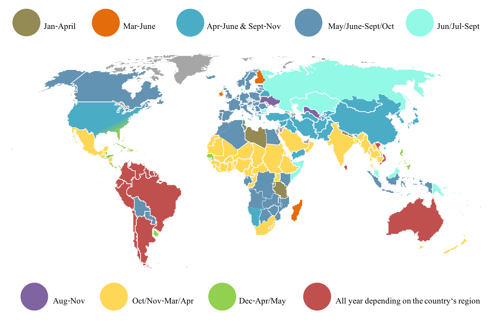     

Working with Google Looker to analyze Travel Bookings and Revenue Metrics

## Intro:

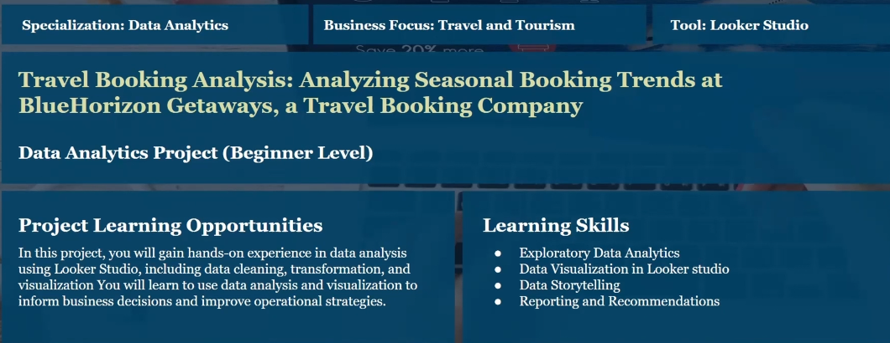   

## BUSINESS INTRODUCTION

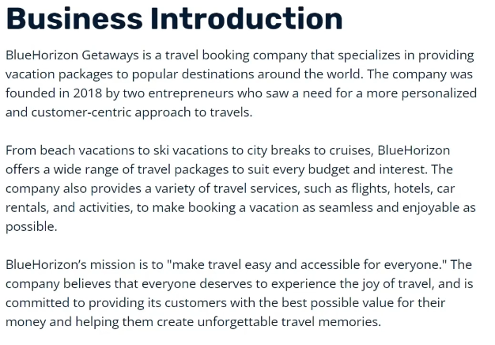

## BUSINESS PROBLEM

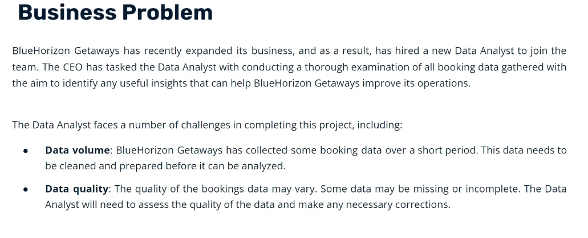

## PROJECT RATIONAL
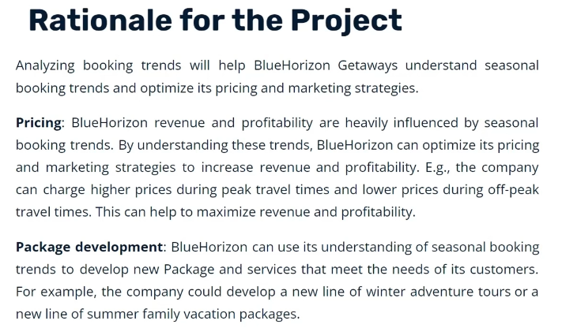

## PROJECT AIM/OBJECTIVE
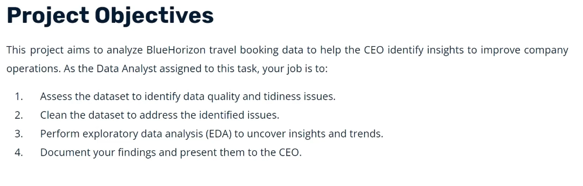

## DATA DESCRIPTION

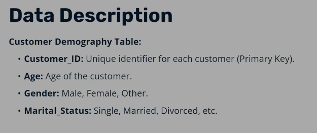

## TECH STACK
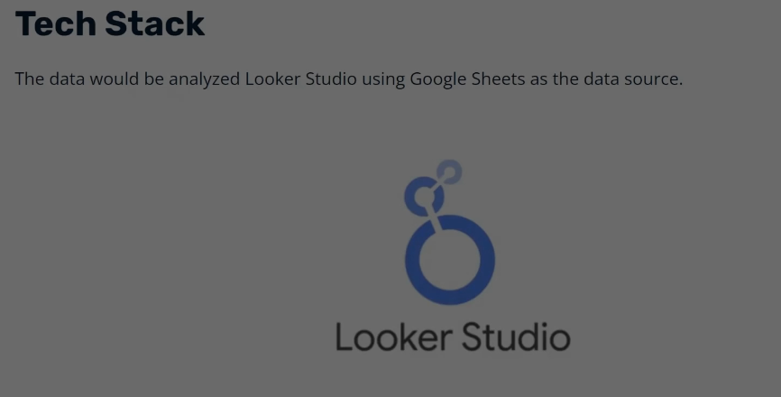

## DATA ANALYSIS
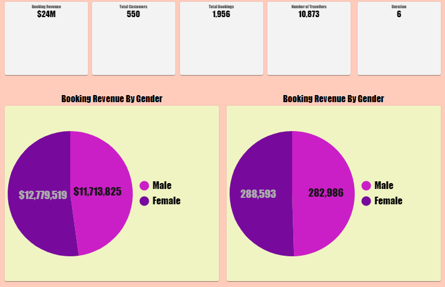

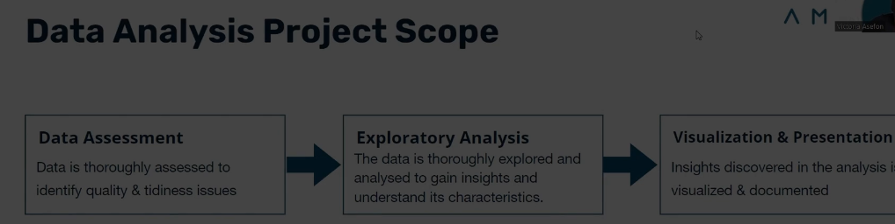

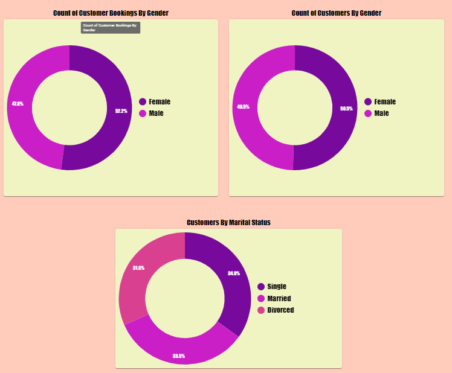

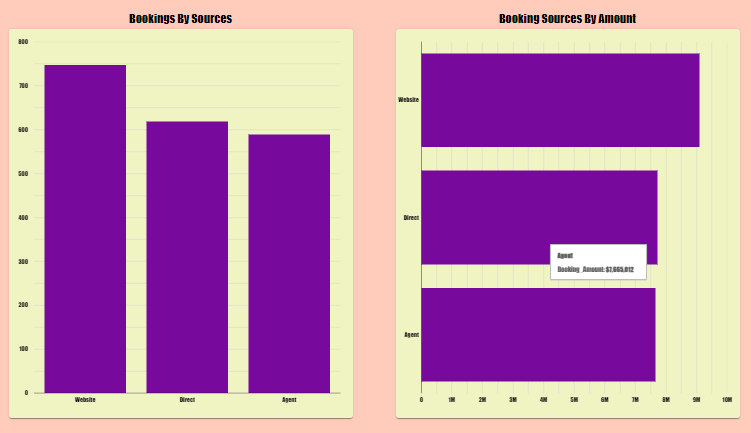

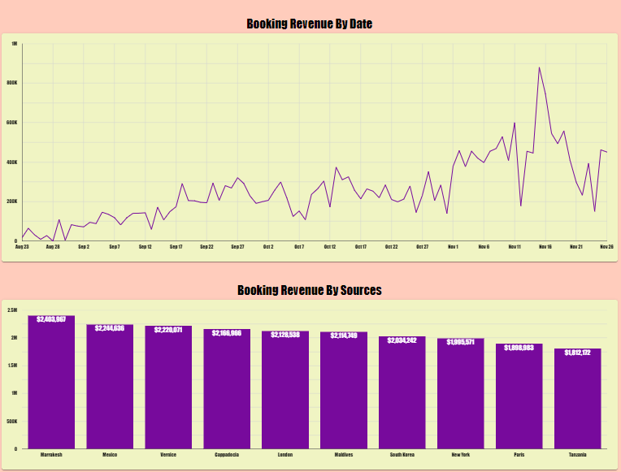

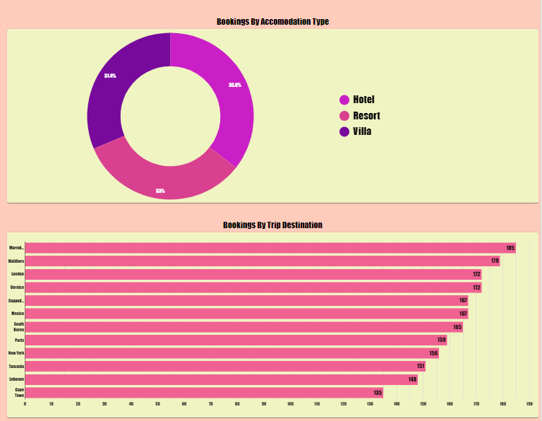

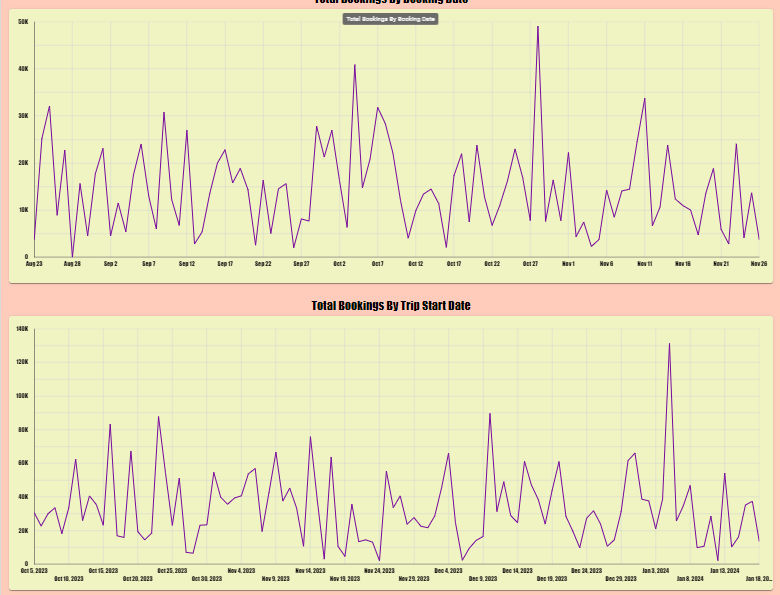

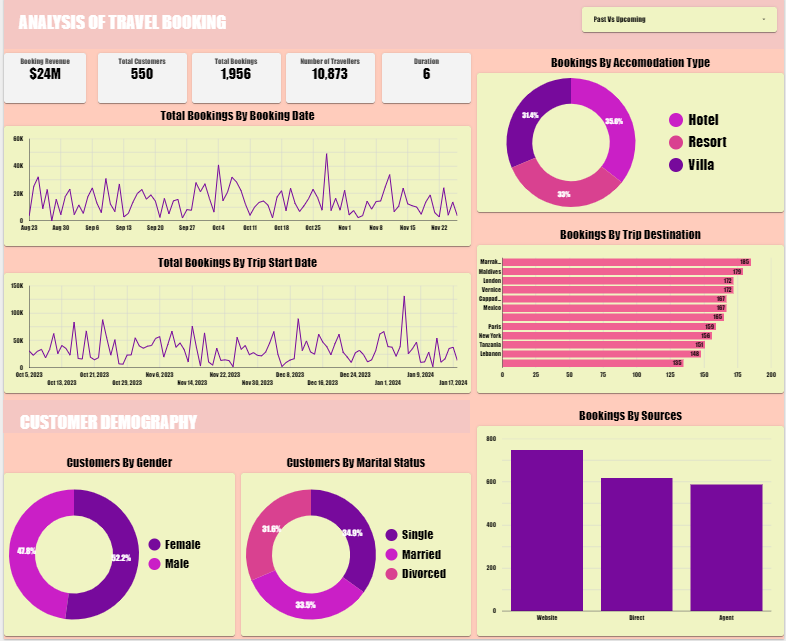

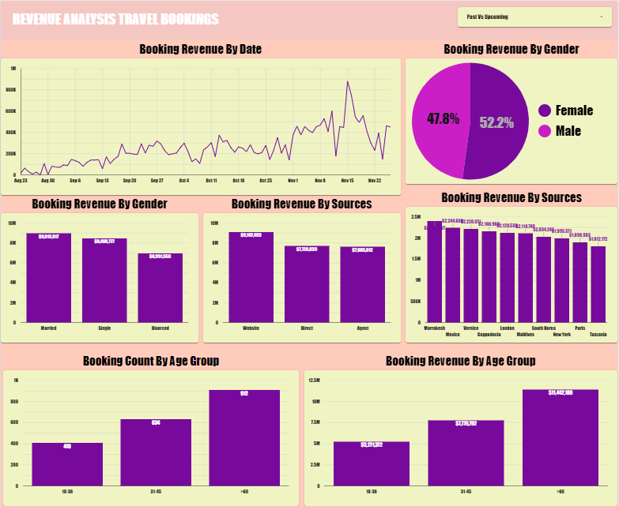

## LINK TO REPORT:
https://lookerstudio.google.com/s/g0u7NZojxjM

Insights_Analysis.PNG

## Insights
1. Between August and November, approximately $24m has been generated in booking revenue with a total of 1,956 bookings made. The company has
helped 5,911 travelers get to their desired destinations between this period.
2. Number of bookings made have peaked since the beginning of November 2023, and with the festive holidays fast approaching in December, more
bookings is expected to be made.
3. There are 900 upcoming booked trips left between December and January 2024. This number is likely to go up with the festive holidays.
4. Marrakesh, Maldives, and London are the top 3 travel destinations booked so far. For the upcoming trips, Marrakesh, Maldives, and South Korea are the
top 3 travel destinations booked.
5. All 3 booking sources as received bookings within similar range. Although, the company's website has the highest number of bookings made, with direct
and agent coming close.
6. More than half of the customers falls between the age of 31-60 and customers between this age group generated the most revenue.

## Recommendations

1. Capitalize on the festive season: With the festive holidays approaching, more bookings are expected to be made. The company should take advantage
of this by offering special promotions and discounts. This could be done through email marketing, or by creating a special holiday landing page on the
company's website.
2. Prepare for High-Demand Periods: Ensure resources and staffing are adequate for the expected surge in bookings around December and January.
Implement last-minute deals to attract spontaneous travelers during holidays.
3. Optimize Booking Channels: Since the website has the highest booking rate, invest in improving the user interface and booking experience. Consider
implementing AI chatbots for instant customer support and personalized recommendations.
4. Promote upcoming trips to popular destinations: Marrakesh, Maldives, and South Korea are the top 3 travel destinations booked for upcoming trips.
The company should focus on promoting these destinations to potential customers. This could be done through social media campaigns, email marketing,
or by creating blog posts or articles about these destinations.
5. Create travel packages and engagement strategies tailored to the preferences of the 31-60 age group, which constitutes the majority of the customer
base and generates the most revenue.
6. Regularly analyze booking trends and customer feedback to refine travel offerings, aligning them with evolving customer preferences and emerging
market trends.

